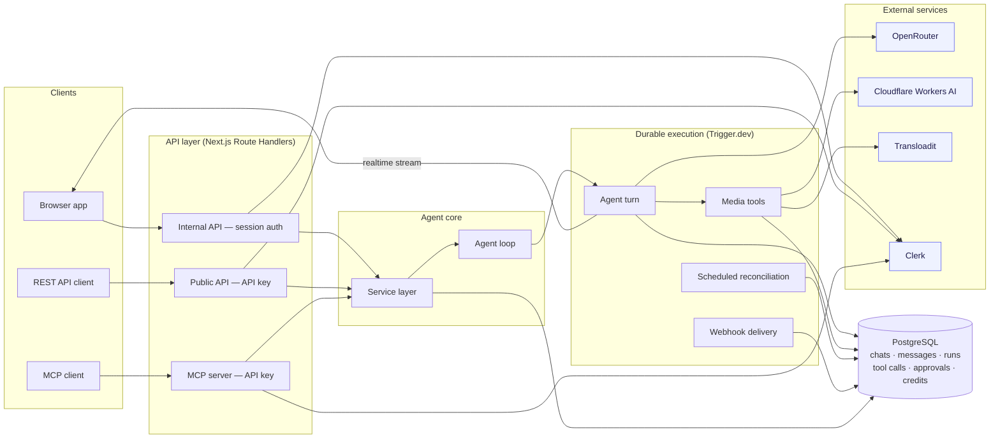
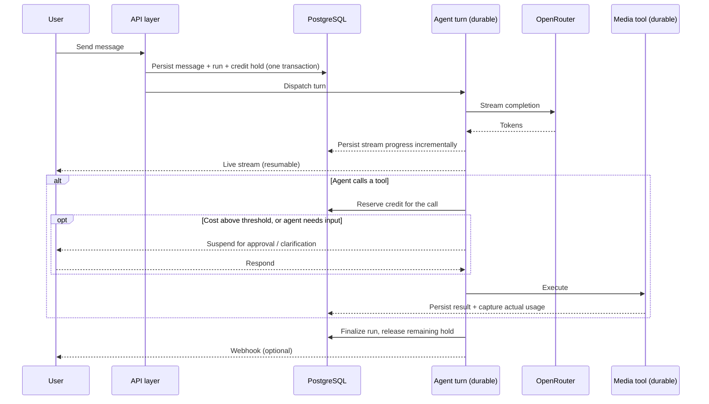

<div align="center">

# VyomFlow

**An agent workspace: multi-turn chat with a tool-using AI agent, real media tools, live streaming,
and durable run recovery.**

[](LICENSE)


[**Live App**](https://vyomflow.co.in) · [**Demo Video**](https://drive.google.com/file/d/1PvFEeLOzvNjFeaUN02x-RXKJRJSgKs2h/view?usp=sharing) · [**API Docs**](https://docs.vyomflow.co.in)

</div>

---

## Overview

VyomFlow is an agent workspace: a chat surface where a tool-using AI agent can crop images,
generate images, and merge videos on your behalf, streaming its work token-by-token as it goes. The
agent pauses to ask for approval before expensive tool calls and to ask you clarifying questions
when it needs them, and every run survives page reloads, network drops, and browser navigation.

Two decisions shape the whole system:

- **PostgreSQL is the durable source of truth; realtime is transport only.** Nothing the UI shows
  can outlive what's actually recorded in the database — a live connection just delivers it faster.
- **One agent core, three surfaces.** The browser app, the public REST API, and the MCP server all
  drive the same underlying agent — there's no separate "API-only" code path with different
  behavior.

## Highlights

- **Resumable streaming** — the resume position is server-owned, so a client that reloads or
  disconnects mid-turn rejoins exactly where it left off, with no skipped or duplicated output.
- **Durable runs** — generation continues server-side regardless of the browser; a run is never
  restarted merely because a client disconnected.
- **One active run per chat** — enforced at the database level, not just in application code.
- **Human-in-the-loop** — the agent suspends on approval before expensive tool calls, or to ask a
  clarifying question, consuming no compute while it waits for you.
- **Credit ledger** — an append-only ledger with reserve → capture/release holds, so estimates are
  settled against actual usage and a balance can always be reconstructed from history.
- **Contracts as the API seam** — shared schemas define every payload, are verified at build time,
  and generate the published OpenAPI reference — the docs can't drift from the code.
- **Self-healing** — a scheduled reconciliation pass sweeps stale runs, orphaned work, and expired
  approvals, so nothing is left stuck in a non-terminal state.
- **Signed outbound webhooks** — delivered out-of-band with secret rotation, so a slow receiver
  never holds up a turn.

## Live

| Surface | URL | Auth |
|---|---|---|
| Web app | https://vyomflow.co.in | Session (sign in) |
| Public REST API | https://api.vyomflow.co.in/api/public/v1 | Bearer API key |
| MCP server | https://api.vyomflow.co.in/api/mcp | Bearer API key |
| Docs & API playground | https://docs.vyomflow.co.in | — |

`vyomflow.co.in` redirects to `www.vyomflow.co.in`. Watch it in action in the
[**demo video**](https://drive.google.com/file/d/1PvFEeLOzvNjFeaUN02x-RXKJRJSgKs2h/view?usp=sharing).

## Architecture

### System



### A turn, start to finish



**Design decisions worth knowing:**

- **Durable state over transport.** UI state always derives from what's persisted in Postgres, not
  from client-owned connection state — a "reconnecting" flag never overrides a confirmed terminal
  status.
- **Concurrency-safe transitions.** Every state change is a guarded conditional write, so two
  concurrent attempts to finalize or resume the same run can't both succeed.
- **Contracts as the seam.** The frontend, backend, and public docs consume the same schema
  definitions, checked for drift at build time.
- **Credits settled, not estimated.** A hold is reserved up front and captured against real usage
  when the work completes, never the other way around.

See [`frontend/README.md`](frontend/README.md) and [`backend/README.md`](backend/README.md) for
the implementation-level detail behind each of these.

## Repository layout

```
frontend/   Next.js (App Router) client — chat UI, attachments, credits, streaming
backend/    Next.js Route Handlers as the REST API — Prisma/PostgreSQL, agent runs, tool execution
test/       Centralized test suites — unit, integration (real Postgres), and frontend (RTL + MSW)
docs/       Public API documentation (Mintlify) — quickstart, concepts, API reference
```

## Tech stack

| Layer | Technology |
|---|---|
| Frontend | Next.js 16, React 19, Tailwind CSS v4, TanStack Query, Zustand |
| Backend | Next.js Route Handlers, Prisma 7, PostgreSQL |
| Durable execution | Trigger.dev (tasks, scheduled runs, realtime streams) |
| Auth | Clerk (session cookies + scoped API keys) |
| AI / media | OpenRouter, Cloudflare Workers AI, sharp, ffmpeg |
| Uploads | Transloadit |
| Contracts | Zod, OpenAPI (generated) |
| Testing | Vitest, React Testing Library, MSW |

## Getting started

```bash
# backend
cd backend
pnpm install
cp .env.example .env.local   # fill in real values
pnpm prisma:migrate
pnpm dev                     # runs on :3000

# frontend (separate shell)
cd frontend
pnpm install
cp .env.example .env.local
pnpm dev                     # runs on :3001

# durable task runtime (separate shell, required for agent turns to execute)
npx trigger.dev@latest dev

# tests (separate shell)
cd test
pnpm install
pnpm test:unit
pnpm test:frontend
pnpm test:integration        # requires the backend's Postgres running
```

Prerequisites: Node.js 20+, pnpm 9.15.9, PostgreSQL, and free-tier accounts for Trigger.dev, Clerk,
OpenRouter, Transloadit, and Cloudflare Workers AI. See
[`frontend/README.md`](frontend/README.md) and [`backend/README.md`](backend/README.md) for the
full environment variable reference for each app.

## Testing

Tests are centralized in [`test/`](test) at three boundaries:

| Suite | Boundary | Files |
|---|---|---|
| `pnpm test:unit` | Pure logic — contracts, agent loop, tool adapters | 25 |
| `pnpm test:integration` | Route Handlers invoked directly against real PostgreSQL | 36 |
| `pnpm test:frontend` | Components via React Testing Library + MSW | 27 |

## API & MCP

Full reference and an interactive playground live at [docs.vyomflow.co.in](https://docs.vyomflow.co.in).
The published OpenAPI document is generated directly from the backend's schema definitions, so it
never drifts from the implementation. Sign in to the web app and mint a scoped API key at
`/settings/api-keys` to use the public REST API or the MCP server.

## License

MIT — see [LICENSE](LICENSE).
